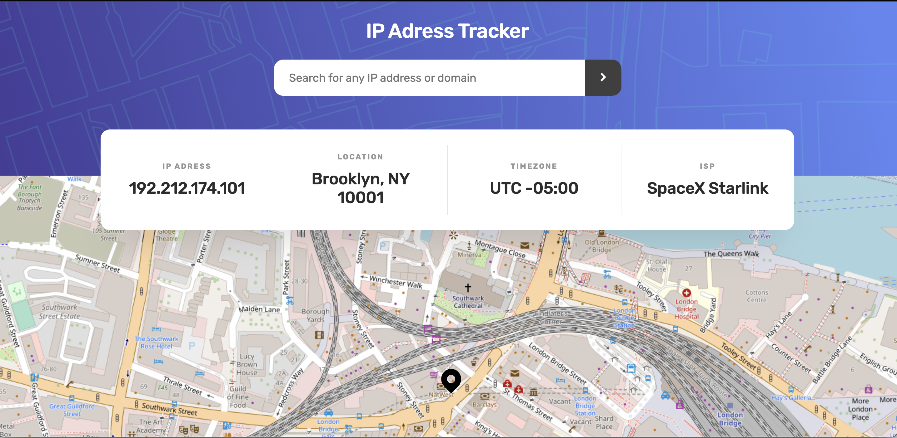

# Frontend Mentor - IP address tracker solution

This is a solution to the [IP address tracker challenge on Frontend Mentor](https://www.frontendmentor.io/challenges/ip-address-tracker-I8-0yYAH0). Frontend Mentor challenges help you improve your coding skills by building realistic projects. 

### Screenshot And Demo

### Links

- Solution URL: [Add solution URL here](https://your-solution-url.com)
- Live Site URL: [Add live site URL here](https://your-live-site-url.com)

### Built with

- Semantic HTML5 markup
- CSS custom properties
- Flexbox
- CSS Grid
- Mobile-first workflow
- [React](https://reactjs.org/) - JS library
- [React Leaflet](https://react-leaflet.js.org/) - React components for Leaflet maps

## Author

- Website - [Guney Unay](https://www.guneyunay.com)
- Frontend Mentor - [@unaygney](https://www.frontendmentor.io/profile/unaygney)

